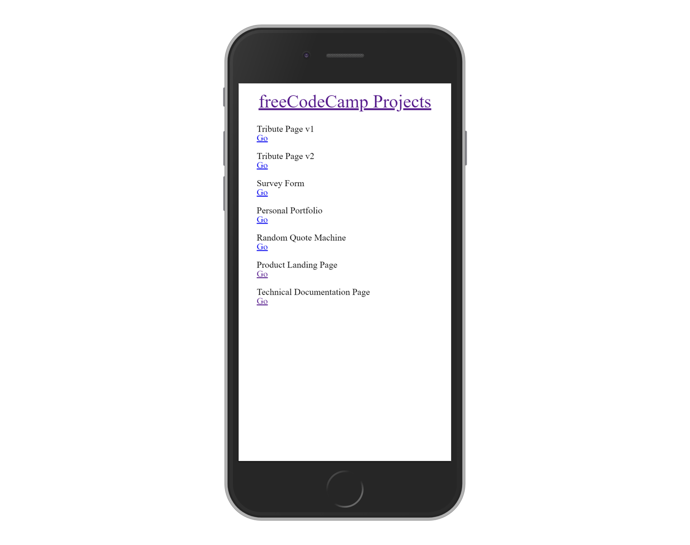

# freeCodeCamp Projects

> All freeCodeCamp projects in one place, updated as I work through the challenges.

[//]: # (Screenshot, Application concept art etc)


[//]: # (Live Demo link)
<p align="center">
  <a href="https://juzqrios.netlify.com/">Live Demo</a>
</p>

## Built With

* HTML
* CSS
* JavaScript

## Get Started

### Setup

1. Clone this repository.

```bash
git clone git@github.com:juzQrios/freecodecamp-projects.git
```

2. Open `index.html` in a browser.

This repository contains many projects(Monorepo?), refer README of the individual projects in their respective folders.

### Tests

While it is a good practice to test code, this project doesn't have any tests right now but I might add them in future.

### Deployment

Deploy the root directory.

## Contributing

Contributions, issues and feature requests are welcome!

Feel free to checkout this project's [Kanban board](https://github.com/juzQrios/freecodecamp-projects/projects/2) or [issues page](https://github.com/juzQrios/freecodecamp-projects/issues).

## Acknowledgments

* [freeCodeCamp](https://www.freecodecamp.org/)

## License

This and all projects in this repository are [MIT](./LICENSE) licensed.

## Authors

#### Darshan

* GitHub: [@juzQrios](https://github.com/juzQrios)
* Linkedin: [Darshan J](https://www.linkedin.com/in/jayadevdarshan/)
* Email: <dj30c.1@gmail.com>
